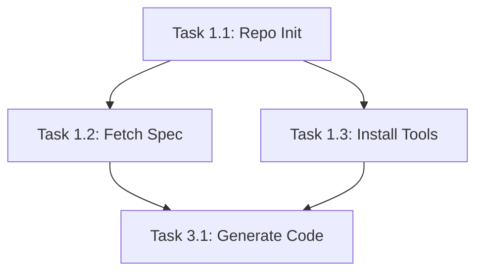

# Implementation Plan Splitter

This skill transforms comprehensive implementation plans into individual story/task files, ensuring each story contains all the context needed for independent execution. Perfect for converting monolithic project plans into actionable tickets for agile development workflows.

## Core Purpose

When implementation plans contain multiple tasks spread across phases, this skill:

1. Extracts individual tasks while preserving their full context
2. Includes relevant project metadata, dependencies, and phase information
3. Generates standalone markdown files ready for import into project management tools
4. Maintains traceability between tasks and the original plan

## When to Use This Skill

Trigger this skill when:

- User has an implementation plan and wants to "split it into stories"
- User mentions breaking down tasks into "separate files" or "individual tickets"
- User needs to "create story files from implementation plan"
- User wants to "extract tasks" or "generate tickets" from a planning document
- User mentions project management tools like Jira, Linear, GitHub Issues, Asana, ClickUp, or Notion

## Input Requirements

The skill works best with implementation plans that include:

- **Clear task structure**: Tasks organized in sections (e.g., "Task 1.1", "Task 2.3")
- **Project metadata**: Version, dates, team members, duration estimates
- **Acceptance criteria**: Checkboxes or bullet points defining completion
- **Implementation details**: Code snippets, commands, or procedural steps
- **Dependencies**: Task relationships and prerequisites
- **Phase/section organization**: Logical grouping of related work

## Story File Output Format

Each generated story file follows this comprehensive structure:

```markdown
# [Task ID]: [Task Title]

**Epic/Phase**: [Phase Name]
**Story Type**: [Task/Bug/Feature/Spike]
**Priority**: [High/Medium/Low - inferred from plan]
**Estimated Time**: [Hours/Days from plan]
**Owner**: [Role or person from plan]

## Project Context

**Project**: [Project Name from plan]
**Version**: [Version number]
**Technical Lead**: [Name]
**Project Manager**: [Name]
**Overall Duration**: [Timeline]

## Description

[Clear, actionable description of what needs to be done, extracted from the task details]

## Acceptance Criteria

[All checkboxes and criteria from the original task, maintaining checkbox format]

- [ ] Criterion 1
- [ ] Criterion 2
- [ ] Criterion 3

## Implementation Details

[Any code snippets, commands, configuration details, or step-by-step instructions from the plan]

## Dependencies

**Blocks**: [List of task IDs that depend on this task]
**Blocked By**: [List of task IDs this task depends on]
**Related**: [Other relevant tasks]

## Phase Information

**Phase**: [Phase number and name]
**Phase Duration**: [Timeline]
**Phase Team**: [Team composition]
**Phase Objective**: [High-level goal]

## Technical Notes

[Any additional technical context, warnings, or considerations]

## Validation/Testing

[How to verify the task is complete, test procedures from plan]

## Resources

[Links to documentation, APIs, tools mentioned in task]

## Tags

`[phase-name]` `[component]` `[technology]` `[task-type]`

---

**Generated from**: [Implementation plan filename]
**Section**: [Original section path in plan]
**Last Updated**: [Generation date]
```

## Process Workflow

### Step 1: Analyze Implementation Plan

1. **Read the entire plan** to understand:

   - Project metadata (name, version, timeline, team)
   - Overall structure (phases, sections, tasks)
   - Task numbering scheme (e.g., 1.1, 1.2, 2.1)
   - Dependency relationships
   - Success criteria and validation methods

2. **Identify task boundaries** by looking for:

   - Explicit task headers (e.g., "Task 1.1", "### Task")
   - Owner assignments
   - Estimated time blocks
   - Acceptance criteria sections
   - Implementation code blocks

3. **Map dependencies** between tasks:
   - Extract "Depends on", "Blocks", "Prerequisites" mentions
   - Note phase sequencing (Phase 2 tasks depend on Phase 1 completion)
   - Identify parallel vs. sequential tasks

### Step 2: Extract Comprehensive Context

For each task, gather:

**From Project Header:**

- Project name, version, date
- PM, Scrum Master, Technical Lead
- Overall duration and delivery strategy

**From Phase Section:**

- Phase number, name, duration
- Phase objectives
- Team composition
- Success criteria for the phase

**From Task Details:**

- Task ID and title
- Owner and estimated time
- Full description
- All acceptance criteria (checkboxes)
- Implementation steps, code, commands
- Validation procedures

**From Surrounding Context:**

- Dependencies (explicit and implicit)
- Related tasks in same phase
- Prerequisites from earlier phases
- Risk mitigation strategies

### Step 3: Enrich Task Context

Add inferred information:

**Priority Inference:**

- Tasks blocking others: High priority
- Foundation tasks (Phase 1): High priority
- Documentation/optional tasks: Medium/Low priority
- Tasks with "critical" or "must" language: High priority

**Story Type Classification:**

- Setup/initialization tasks: Task
- Feature implementation: Feature
- Testing/validation: Task
- Documentation: Task
- Investigation/research: Spike
- Fixing issues: Bug

**Tags Generation:**

- Phase name (e.g., `phase-1-foundation`)
- Technology stack (e.g., `react-native`, `python`, `ci-cd`)
- Component (e.g., `security`, `authentication`, `testing`)
- Task type (e.g., `setup`, `implementation`, `documentation`)

### Step 4: Generate Story Files

1. **Create output directory structure:**

   ```
   stories/
   ├── phase-1-foundation/
   │   ├── task-1.1-repository-initialization.md
   │   ├── task-1.2-fetch-openapi-spec.md
   │   └── ...
   ├── phase-2-security/
   │   └── ...
   └── README.md
   ```

2. **Write each story file** following the output format template

3. **Generate README.md** with:
   - Project overview
   - Story file index
   - Dependency graph
   - Import instructions for various tools

### Step 5: Provide Summary and Next Steps

After generation, provide:

- Count of story files created
- Organization structure summary
- Import instructions for popular tools (Jira, Linear, GitHub)
- Dependency warnings (circular dependencies, missing tasks)
- Recommendations for task sequencing

## Tool Integration Guidance

### GitHub Issues Import

```bash
# Using GitHub CLI
for file in stories/phase-*/*.md; do
  gh issue create --title "$(head -1 $file)" --body-file "$file" --label "implementation"
done
```

### Jira CSV Import Format

Generate CSV alongside markdown files with columns:

- Summary (Task ID + Title)
- Description (Full story content)
- Issue Type (Story/Task/Spike)
- Priority
- Assignee (Owner)
- Labels (Tags)
- Epic Link (Phase)

### Linear Import

Linear accepts markdown files directly via API or manual upload to project.

### ClickUp

Use ClickUp's Markdown import or the skill's integration with clickup-task-creator skill for automated creation.

## Edge Cases and Error Handling

**Missing Metadata:**

- If project metadata absent, infer from filename or ask user
- If task IDs missing, generate sequential IDs (TASK-001, TASK-002)

**Ambiguous Task Boundaries:**

- If unclear where one task ends and another begins, ask for clarification
- Provide preview of first 3 tasks for user validation

**Dependency Conflicts:**

- Detect circular dependencies and warn user
- Suggest dependency resolution strategies

**Large Plans (100+ tasks):**

- Confirm with user before generating large numbers of files
- Offer to generate by phase or subset

## Quality Checks

Before finalizing output:

- [ ] Every story has a unique identifier
- [ ] All acceptance criteria preserved
- [ ] Implementation code blocks correctly formatted
- [ ] Dependencies accurately mapped
- [ ] No orphaned references to other tasks
- [ ] README.md provides complete navigation
- [ ] Tags are relevant and consistent

## Best Practices

1. **Preserve Original Intent**: Don't paraphrase or simplify the original task details—maintain exact wording for acceptance criteria and technical requirements.

2. **Self-Contained Context**: Each story should be understandable without referring back to the original plan. Include all necessary background.

3. **Actionable Descriptions**: Start descriptions with action verbs (Create, Configure, Implement, Test, Document).

4. **Realistic Dependencies**: Only mark explicit dependencies. Don't over-specify relationships that aren't critical.

5. **Consistent Formatting**: Use the same markdown structure for all stories to enable automated parsing.

6. **Traceability**: Always include "Generated from" footer linking back to source plan and section.

## Examples

### Example 1: Simple Task Extraction

**Input**: Implementation plan with Task 1.1 (Repository Initialization)

**Output**: `stories/phase-1-foundation/task-1.1-repository-initialization.md`

- Includes full project context from plan header
- Contains all 6 acceptance criteria checkboxes
- Preserves bash script from implementation section
- Maps to blocked tasks (Tasks 1.2-1.5)
- Tagged with `phase-1-foundation`, `setup`, `git`

### Example 2: Complex Task with Dependencies

**Input**: Task 3.2 (Security Wrapper Implementation)

**Output**: `stories/phase-3-client-generation/task-3.2-security-wrapper.md`

- Shows dependency on Task 2.1 (Cert Pinning) completion
- Lists tasks it blocks (Task 3.3, 3.4)
- Includes security implementation code
- References security checklist from appendix
- Tagged with `phase-3-client-generation`, `security`, `typescript`

### Example 3: Multi-Phase Plan

**Input**: 6-phase implementation plan with 30 tasks

**Output**: Organized directory structure:

```
stories/
├── phase-1-foundation/ (5 tasks)
├── phase-2-security/ (4 tasks)
├── phase-3-client-generation/ (4 tasks)
├── phase-4-testing/ (4 tasks)
├── phase-5-documentation/ (4 tasks)
├── phase-6-platform-expansion/ (9 tasks, 3 per platform)
└── README.md (navigation + dependency graph)
```

## Advanced Features

### Dependency Graph Generation

When requested, generate Mermaid diagram showing task relationships:



### Filtering and Subsetting

Support commands like:

- "Only generate stories for Phase 1"
- "Create stories for security-related tasks only"
- "Generate stories assigned to Backend Engineer"

### Template Customization

Allow users to provide custom story templates or override the default structure for specific tools.

## Troubleshooting

**Issue**: Stories missing implementation details

- **Fix**: Ensure task sections in plan have clear "Implementation" headers

**Issue**: Dependency references broken

- **Fix**: Verify all referenced task IDs exist in plan, update references

**Issue**: Acceptance criteria not detected

- **Fix**: Look for checkbox patterns beyond standard `[ ]`, include numbered lists

**Issue**: Too many or too few stories generated

- **Fix**: Adjust task detection criteria, confirm boundaries with user

## Integration with Other Skills

This skill works well with:

- **clickup-task-creator**: Automatically create ClickUp tasks from generated stories
- **notion-spec-to-implementation**: Reverse workflow—create implementation plans from Notion specs, then split into stories
- **internal-comms**: Draft team announcements about sprint planning with story references

## Limitations

- Cannot automatically prioritize tasks without explicit indicators in plan
- May struggle with plans lacking clear task structure or numbering
- Does not integrate directly with project management APIs (requires manual import or other skills)
- Cannot resolve ambiguous dependencies—requires clear "depends on" language

## File Naming Conventions

Generated story files follow this pattern:

```
task-[phase].[number]-[slugified-title].md
```

Examples:

- `task-1.1-repository-initialization.md`
- `task-3.2-security-wrapper-implementation.md`
- `task-5.4-internal-team-onboarding.md`

This ensures:

- Alphabetical sorting matches execution order
- Filenames are human-readable
- No special characters cause filesystem issues
- Easy to reference in documentation

## Output Location

All generated story files are saved to:

```
/mnt/user-data/outputs/stories/
```

With subdirectories per phase and a root README.md for navigation.

---

## Quick Start

**Typical Usage:**

```
User: "Use the implementation plan splitter skill to break down this plan into separate story files"

Claude:
1. Reads and analyzes the implementation plan
2. Identifies 30 tasks across 6 phases
3. Creates stories/ directory structure
4. Generates 30 story markdown files with full context
5. Creates README.md with navigation and dependency graph
6. Provides import instructions for target tool (Jira/Linear/GitHub)
```

**Key Success Factor**: Every generated story should be fully actionable by an engineer who hasn't read the original implementation plan.
