```mermaid
graph TD
    A[Login as GESTOR] --> B[Navigate to Reports page]
    B --> C[Select 'Relatório Mensal RMA']
    C --> D[Form appears: Month/Year selectors]
    D --> E[Select desired month + year]
    E --> F[Click 'Gerar Relatório']
    F --> G[Show loading: 'Gerando relatório...']
    G --> H{Report generation}
    H -->|Success| I[Display report preview on page]
    I --> J[Show metrics: Total atendimentos, by type, etc.]
    J --> K[Display 'Última atualização' timestamp]
    K --> L{User action}
    L -->|Export PDF| M[Click 'Exportar PDF']
    L -->|Export Excel| N[Click 'Exportar Excel']
    L -->|Change period| E

    M --> O[Show 'Preparando arquivo...']
    O --> P{PDF generation}
    P -->|Success| Q[Download file: RMA_Mes_Ano.pdf]
    P -->|Error| R[Show error toast]

    N --> S[Show 'Preparando arquivo...']
    S --> T{Excel generation}
    T -->|Success| U[Download file: RMA_Mes_Ano.xlsx]
    T -->|Error| R

    H -->|Error| V[Show error: 'Não foi possível gerar']
    V --> W[Offer retry button]
    W --> F

    style I fill:#e1f5e1
    style Q fill:#e1f5e1
    style U fill:#e1f5e1
    style V fill:#ffe1e1
```

# AuroraSocial UX/UI Specification

_Generated on 2025-10-31 by Fusuma_

## Executive Summary

**AuroraSocial** is a multi-tenant SaaS platform designed to digitize and streamline social assistance management for small and mid-sized Brazilian municipalities. The platform replaces paper-based processes with a centralized digital system that enables social workers (Técnicos) to efficiently manage citizen profiles, record assistance visits, and attach documentation, while empowering public managers (Gestores) with dashboards and compliance reports.

The platform must balance **efficiency** for daily operational users with **governance clarity** for strategic decision-makers, all while maintaining strict LGPD compliance and SUAS (Sistema Único de Assistência Social) standards. The UX must be intuitive enough to minimize training requirements while providing the data integrity and audit trails required for public sector accountability.

---

## 1. UX Goals and Principles

### 1.1 Target User Personas

#### **Primary Persona: Maria - Técnico de Referência (Social Worker)**

**Demographics:**
- Age: 28-45
- Education: Social work degree
- Tech proficiency: Basic to intermediate
- Work context: Municipal CRAS (Centro de Referência de Assistência Social)

**Goals:**
- Quickly access complete citizen history before appointments
- Register assistance visits without bureaucratic overhead
- Avoid duplicating data entry from paper forms
- Maintain organized documentation for each family

**Pain Points:**
- Lost or misplaced paper records ("fichas de papel perdidas")
- Time wasted on administrative tasks instead of citizen care
- Difficulty finding citizen information across scattered files
- Manual compilation of monthly reports

**Behavioral Traits:**
- Task-focused, needs efficiency during busy days
- Values simplicity and clear workflows
- May resist complex technology if it slows work down
- Highly empathetic, prioritizes human connection

---

#### **Secondary Persona: Carlos - Gestor Público (Public Manager)**

**Demographics:**
- Age: 35-55
- Education: Public administration or social services
- Tech proficiency: Intermediate
- Work context: Municipal Secretary of Social Assistance

**Goals:**
- Prove program impact to municipal leadership
- Ensure SUAS compliance and avoid audit issues
- Monitor team performance and workload distribution
- Make data-driven decisions about resource allocation

**Pain Points:**
- Lack of real-time visibility into operations
- Manual compilation of compliance reports (RMA)
- Difficulty demonstrating program success with raw data
- Cannot track team productivity or citizen coverage

**Behavioral Traits:**
- Strategic thinker, values governance and transparency
- Needs "narratives of success" backed by data
- Accountable for LGPD compliance and public funds
- Appreciates clear visualizations over raw numbers

---

### 1.2 Usability Goals

1. **Efficiency (Primary for Técnicos):**
   - Reduce clicks to register common actions (max 3 clicks to start recording an assistance visit)
   - Enable fast citizen search with forgiving input (ignore accents, partial names, CPF formats)
   - Pre-populate forms with contextual data (date/time, logged-in user)
   - Target: 30% reduction in time spent on administrative tasks

2. **Learnability (Critical for Both Personas):**
   - New users can perform core tasks within 15 minutes without training
   - Guided workflows with clear next steps
   - Contextual help and tooltips where needed
   - Minimize reliance on support documentation (NFR7)

3. **Error Prevention (LGPD Compliance):**
   - Validate duplicate CPF entries before saving
   - Confirm destructive actions (delete user, remove attachments)
   - Restrict file upload types and sizes with clear feedback
   - Prevent cross-tenant data access at UI layer

4. **Accessibility (Legal Requirement):**
   - WCAG AA compliance for all interfaces
   - Keyboard navigation for all workflows
   - Screen reader compatibility
   - Sufficient color contrast (4.5:1 for text)

5. **Transparency (Governance):**
   - Always display "last updated" timestamps on dashboards
   - Show audit trails for profile edits
   - Clear indication of data refresh intervals
   - Export capabilities for external analysis

---

### 1.3 Design Principles

1. **"Invisible Assistant" (for Técnicos)**
   - The system should fade into the background during citizen interactions
   - Minimize cognitive load by anticipating needs
   - Prioritize speed over feature discovery
   - *Example: Pre-fill assistance date/time, auto-save drafts*

2. **"Data as Narrative" (for Gestores)**
   - Transform raw numbers into meaningful stories
   - Use visual hierarchy to highlight key insights
   - Provide context with comparisons (month-over-month, targets)
   - *Example: "1,243 families served this month (+12% vs. last month)"*

3. **"Trust Through Clarity"**
   - Be explicit about data handling (LGPD reassurance)
   - Show system status during async operations (uploads, report generation)
   - Use plain language, avoid technical jargon
   - *Example: "Gerando relatório..." with progress indicator*

4. **"Progressive Disclosure"**
   - Show essential information first, advanced options on demand
   - Avoid overwhelming users with all features at once
   - Use expandable sections for optional details
   - *Example: Profile view shows summary, expands for full CadÚnico fields*

5. **"Mobile-Mindful, Desktop-Optimized"**
   - While responsive, optimize for desktop workflows (primary use case)
   - Ensure mobile views support field visits (profile lookup, photo uploads)
   - Touch targets ≥44px on mobile
   - *Example: Dashboard cards stack vertically on mobile*

---

## 2. Information Architecture

### 2.1 Site Map

```
AuroraSocial
│
├── 🔐 Authentication (Public)
│   ├── Login
│   └── Password Reset
│
├── 👤 TÉCNICO View (Role: TECNICO)
│   │
│   ├── 🏠 Home/Search
│   │   └── Citizen/Family Search (Primary Landing)
│   │
│   ├── 👥 Citizen Management
│   │   ├── Profile View (Individual/Family)
│   │   │   ├── Overview Tab
│   │   │   ├── History Tab (Atendimentos)
│   │   │   ├── Attachments Tab
│   │   │   └── Edit Profile
│   │   ├── Create New Profile
│   │   └── Register Assistance Visit (Modal)
│   │
│   └── ⚙️ Account Settings
│       └── Personal Profile
│
├── 📊 GESTOR View (Role: GESTOR)
│   │
│   ├── 📈 Dashboard (Primary Landing)
│   │   ├── Key Metrics Cards
│   │   ├── Recent Activity
│   │   └── Quick Actions
│   │
│   ├── 👥 Citizen Management (Inherited from TECNICO)
│   │   └── [Same structure as TECNICO]
│   │
│   ├── 📑 Reports & Compliance
│   │   ├── Generate RMA (Relatório Mensal de Atendimentos)
│   │   ├── Custom Reports
│   │   └── Export Center (PDF/Excel)
│   │
│   ├── 👨‍💼 Team Management
│   │   ├── User List (View All)
│   │   ├── Invite User
│   │   ├── Manage Permissions
│   │   └── Activity Audit Log
│   │
│   ├── 📥 Data Management
│   │   └── Bulk Import (CSV)
│   │
│   └── ⚙️ Account Settings
│       ├── Personal Profile
│       └── Municipality Settings
│
└── 🚫 Error States
    ├── 404 - Page Not Found
    ├── 403 - Access Denied
    └── 500 - Server Error
```

**Information Architecture Notes:**

1. **Role-Based Structure**: Clear separation between TECNICO (operational) and GESTOR (strategic + operational) views
2. **Primary Landing Pages**:
   - TECNICO → Search (task-focused entry point)
   - GESTOR → Dashboard (strategic overview)
3. **Shared Access**: Gestores inherit TECNICO capabilities (can perform all citizen management tasks)
4. **Deep Linking**: All profiles, reports, and records have unique URLs for bookmarking and sharing
5. **Multi-Tenant Isolation**: All queries filter by `tenantId` (never exposed in UI, enforced at data layer)

---

### 2.2 Navigation Structure

#### **Primary Navigation (Top Bar)**

**For TÉCNICO Role:**
```
[AuroraSocial Logo] | 🔍 Pesquisar | 👤 [User Menu ▾]
                                         ├── Meu Perfil
                                         └── Sair
```

**For GESTOR Role:**
```
[AuroraSocial Logo] | 📊 Dashboard | 🔍 Pesquisar | 📑 Relatórios | 👨‍💼 Equipe | 👤 [User Menu ▾]
                                                                                    ├── Meu Perfil
                                                                                    ├── Configurações
                                                                                    └── Sair
```

**Navigation Behavior:**
- Fixed top bar (always visible during scroll)
- Active state highlighting for current section
- Badge indicators for notifications (e.g., failed imports)
- Municipality name displayed near logo (multi-tenant context)

---

#### **Secondary Navigation (Contextual)**

**Profile View Tabs** (within Citizen Management):
```
[← Voltar à Pesquisa]

João Silva Santos | CPF: ***.***.123-45
────────────────────────────────────────────
📋 Visão Geral | 📜 Histórico de Atendimentos | 📎 Anexos

[Tab content area]
```

**Reports Page Sub-Navigation** (side panel):
```
Relatórios
├── 📄 Relatório Mensal (RMA)
├── 📊 Atendimentos por Tipo
├── 📈 Famílias Cadastradas
└── 🔍 Relatório Customizado
```

---

#### **Mobile Navigation Strategy**

**Hamburger Menu** (< 768px):
```
☰ → Expands to:
    ├── 🔍 Pesquisar
    ├── 📊 Dashboard (GESTOR only)
    ├── 📑 Relatórios (GESTOR only)
    ├── 👨‍💼 Equipe (GESTOR only)
    └── ⚙️ Configurações
```

**Bottom Navigation Bar** (Mobile - TECNICO):
```
[🔍 Buscar] [➕ Novo Cadastro] [👤 Perfil]
```

---

#### **Breadcrumb Structure**

For deep navigation paths:
```
Home > Pesquisa > João Silva Santos > Editar Perfil
```

**Breadcrumb Rules:**
- Only show when 3+ levels deep
- Each segment is clickable (returns to that level)
- Truncate middle segments on mobile (Home > ... > Current)

---

#### **Quick Actions (Floating Action Button - Mobile Only)**

For TÉCNICO role on profile view:
```
[+] → Expands to:
    ├── 📝 Registrar Atendimento
    ├── 📎 Adicionar Anexo
    └── ✏️ Editar Perfil
```

---

## 3. User Flows

### Flow 1: Search and Access Citizen Profile (TÉCNICO Primary Flow)

**User Goal:** Find a citizen's complete history before an assistance visit

**Entry Points:**
- Direct navigation to Search page (landing page for TÉCNICO)
- Global search in top navigation

**Flow Diagram:**


**Success Criteria:**
- Search results appear within 500ms
- Profile loads in < 1 second
- User can register an atendimento in < 60 seconds from search

**Error States:**
- Network timeout → Show retry button
- Profile not found → Clear "Create New" CTA
- No search term → Disable search, show placeholder text

---

### Flow 2: Register Assistance Visit (TÉCNICO Core Task)

**User Goal:** Quickly document an assistance interaction without losing context

**Entry Points:**
- "Registrar Atendimento" button on Profile View
- Quick action FAB (mobile)

**Flow Diagram:**


**Success Criteria:**
- Modal opens instantly (< 100ms)
- Auto-save draft every 30 seconds (local storage)
- Form submits in < 2 seconds
- Clear confirmation of saved record

**Error States:**
- Network error → Keep modal open, show retry
- Validation errors → Inline field-level messages
- Session expired → Prompt re-login, preserve draft

---

### Flow 3: Generate and Export Monthly Report (GESTOR Compliance Flow)

**User Goal:** Create official RMA report for SUAS compliance

**Entry Points:**
- Dashboard "Generate Report" quick action
- Reports navigation menu item

**Flow Diagram:**



**Success Criteria:**
- Report generation completes in < 5 seconds
- Export files download automatically
- File names are descriptive and dated
- Data in preview matches exported files

**Error States:**
- No data for period → Show empty state with explanation
- Generation timeout → Show retry option
- Export failure → Keep preview, allow re-export

---

### Flow 4: Invite New Team Member (GESTOR Team Management)

**User Goal:** Add a new social worker to the platform

**Entry Points:**
- Team Management page
- Dashboard "Quick Actions" card

**Flow Diagram:**

```mermaid
graph TD
    A[Navigate to Team Management] --> B[View current user list]
    B --> C[Click 'Convidar Usuário']
    C --> D[Modal opens with invitation form]
    D --> E[Enter email address]
    E --> F[Select role: TECNICO or GESTOR]
    F --> G[Optional: Enter name]
    G --> H{Form validation}
    H -->|Invalid| I[Show validation errors]
    I --> E
    H -->|Valid| J[Click 'Enviar Convite']
    J --> K[Show loading spinner]
    K --> L{Invitation sent?}
    L -->|Success| M[Modal closes]
    M --> N[New user appears in list with 'Pending' badge]
    N --> O[Success toast: 'Convite enviado para [email]']
    L -->|Error: Duplicate| P[Show error: 'Email já cadastrado']
    P --> Q[Highlight existing user in list]
    L -->|Error: Other| R[Show generic error message]
    R --> S[Keep form open for retry]

    O --> T[Email sent to invited user]
    T --> U[User clicks link in email]
    U --> V[Password setup screen]
    V --> W[User sets password + logs in]
    W --> X[Badge changes from 'Pending' to 'Active']

    style O fill:#e1f5e1
    style P fill:#fff4e1
    style X fill:#e1f5e1
```

**Success Criteria:**
- Invitation sent within 2 seconds
- Clear feedback on invitation status
- Duplicate email detected before sending
- New user auto-associated with correct tenantId

**Error States:**
- Invalid email format → Inline validation
- Email already exists → Show existing user
- Email service failure → Allow retry with same form data

---

### Flow 5: Bulk Import Citizen Data (GESTOR Onboarding)

**User Goal:** Import existing citizen records during initial system setup

**Entry Points:**
- Data Management page
- Onboarding wizard (Story 2.7)

**Flow Diagram:**


**Success Criteria:**
- Template provides clear column headers
- Validation completes before import starts
- Detailed error report for failed rows
- Clear success metrics shown

**Error States:**
- Invalid file format → Show supported formats
- Duplicate CPF detected → List all duplicates
- File too large → Show size limit and split instructions
- Import timeout → Save partial import, allow resume

---

## 4. Component Library and Design System

### 4.1 Design System Approach

**Recommendation: Hybrid Approach with shadcn/ui**

Given the project constraints (Next.js, WCAG AA compliance, professional public sector aesthetic), I recommend using **shadcn/ui** as the foundation with custom adaptations:

**Rationale:**
1. **shadcn/ui Benefits:**
   - Built on Radix UI primitives (excellent accessibility out-of-box)
   - Copy-paste components (no dependency bloat)
   - Tailwind CSS integration (matches Next.js ecosystem)
   - Customizable (not opinionated like Material UI)
   - Built-in keyboard navigation and ARIA attributes

2. **Custom Adaptations Needed:**
   - Color palette adjusted for Brazilian public sector aesthetic (trust, professionalism)
   - Portuguese language labels and messaging
   - Form components aligned with CadÚnico field types
   - Data table components optimized for citizen records display

3. **Technology Stack:**
   - **UI Framework**: shadcn/ui + Radix UI primitives
   - **Styling**: Tailwind CSS (already in Next.js ecosystem)
   - **Icons**: Lucide React (lightweight, consistent)
   - **Forms**: React Hook Form + Zod (type-safe validation)
   - **Tables**: TanStack Table (complex data display)
   - **Charts**: Recharts (dashboard visualizations)

---

### 4.2 Core Components

#### **1. Search Input Component**

**Purpose:** Forgiving search for citizen/family names and CPF

**Variants:** `default`, `compact`, `with-filters`

**States:** Default, Active/Focus, Typing, Loading, Error, Results

**Accessibility:** `aria-label`, keyboard navigation, screen reader announces result count

**Usage:** Debounce 300ms, ignore accents, auto-format CPF, show "No results" with "Create New" button

---

#### **2. Profile Card Component**

**Purpose:** Display citizen summary in search results and profile overview

**Variants:** `list-item`, `hero`, `summary`

**Key Elements:** Avatar, Name, Masked CPF, Status badges, Last interaction, Action buttons

**Accessibility:** Entire card clickable, `role="article"`, clear focus states

---

#### **3. Data Table Component**

**Purpose:** Display lists of users, atendimentos, citizens

**Variants:** `default`, `compact`, `selectable`

**Key Features:** Sortable columns, pagination, row actions, responsive (cards on mobile), export

**Accessibility:** Proper `<table>` semantics, `aria-sort`, keyboard navigation

---

#### **4. Modal Component**

**Purpose:** Forms and dialogs (register atendimento, invite user, confirmations)

**Sizes:** `sm` (400px), `md` (600px), `lg` (800px), `fullscreen` (mobile)

**Key Elements:** Header with close button, scrollable content, footer actions, backdrop

**Accessibility:** Focus trap, Esc closes, `aria-modal="true"`, focus returns to trigger

**Usage:** Confirm close if unsaved changes, primary action on right, max height 80vh

---

#### **5. Form Input Components**

**Component Types:**

**a) Text Input** - Variants: text, email, tel, password, cpf, number
**b) Textarea** - Auto-expanding (up to 8 rows), character counter
**c) Select/Dropdown** - Searchable for long lists, multi-select with chips
**d) Date Picker** - Calendar popup (desktop), native picker (mobile)
**e) File Upload** - Drag-and-drop, type restrictions (.jpg, .png, .pdf), 10MB limit, preview thumbnails
**f) Checkbox & Radio** - Large click target (44px × 44px), clear focus indicator

**Accessibility (All Inputs):** Associated labels, `aria-required`, `aria-invalid`, clear error messages, 4.5:1 contrast

---

#### **6. Button Component**

**Variants:** `primary` (blue CTA), `secondary` (outlined), `ghost` (text only), `destructive` (red), `link`

**Sizes:** `sm` (32px), `md` (40px), `lg` (48px)

**States:** Default, Hover, Active, Focus (2px outline), Loading (spinner), Disabled (50% opacity)

**Accessibility:** Min 44px touch target (mobile), `aria-busy` when loading

---

#### **7. Toast Notification Component**

**Variants:** `success` (green ✓), `error` (red ✗), `warning` (yellow ⚠), `info` (blue ℹ)

**Behavior:** Auto-dismiss 4s (configurable), persistent for errors, action link optional, stack multiple

**Accessibility:** `role="status"` or `role="alert"`, screen reader announces, keyboard dismissible

---

#### **8. Badge Component**

**Purpose:** Status indicators and tags

**Variants:** `status` (colored dot + text), `count` (numeric), `role` (TECNICO/GESTOR), `tag`

**Colors:** Green (Active), Yellow (Pending), Red (Inactive), Blue (Info/GESTOR), Gray (TECNICO/Archived)

**Accessibility:** Clear text (not just color), icons supplement color, appropriate contrast

---

#### **9. Loading Skeleton Component**

**Variants:** `text`, `card`, `circle`, `table`

**Animation:** Subtle shimmer (1.5s infinite)

**Usage:** Match actual content layout, show immediately, avoid flash on fast loads (<200ms)

---

#### **10. Empty State Component**

**Variants:** `no-results`, `no-data`, `error`, `permission-denied`

**Key Elements:** Icon/illustration, heading, description, primary action, secondary action

**Accessibility:** Clear headings, actionable next steps, keyboard accessible

---

## 5. Visual Design Foundation

### 5.1 Color Palette

**Design Philosophy:** Professional, trustworthy, and accessible for Brazilian public sector. Colors convey stability and competence while maintaining warmth appropriate for social assistance work.

#### **Primary Colors (Brand & Actions)**

```css
/* Primary Blue - Trust & Professionalism */
--primary-500: #3B82F6;  /* Primary buttons, links (BASE) */
--primary-600: #2563EB;  /* Primary hover */
--primary-700: #1D4ED8;  /* Primary active */
/* Full scale: 50-900 available for backgrounds, borders */
```

#### **Neutral Colors (Structure & Typography)**

```css
/* Grays - Layout & Text */
--neutral-50:  #F9FAFB;  /* Page background */
--neutral-100: #F3F4F6;  /* Card background */
--neutral-600: #4B5563;  /* Body text (BASE - 7.0:1 contrast) */
--neutral-700: #374151;  /* Headings */
```

#### **Semantic Colors (Status & Feedback)**

```css
--success-500: #22C55E;  /* Active status, success */
--warning-600: #D97706;  /* Pending (uses 600 for WCAG AA) */
--error-500: #EF4444;    /* Inactive, errors */
--info-500: #3B82F6;     /* Info, GESTOR badge */
```

#### **Accessibility Compliance**

| Color on White | Contrast | WCAG AA |
|----------------|----------|---------|
| neutral-600 | 7.0:1 | ✓ AAA |
| primary-500 | 4.7:1 | ✓ Pass |
| success-500 | 4.5:1 | ✓ Pass |
| error-500 | 4.5:1 | ✓ Pass |
| warning-600 | 4.6:1 | ✓ Pass |

---

### 5.2 Typography

**Font Families:**

```css
--font-sans: 'Inter', -apple-system, BlinkMacSystemFont, sans-serif;
--font-mono: 'JetBrains Mono', 'Courier New', monospace;
```

**Rationale:** Inter for excellent screen readability, JetBrains Mono for CPF/date formatting

**Type Scale:**

```css
--text-display: 3rem (48px) / 700     /* Hero sections */
--text-h1: 2.25rem (36px) / 700       /* Page titles */
--text-h2: 1.875rem (30px) / 600      /* Section titles */
--text-h3: 1.5rem (24px) / 600        /* Subsection titles */
--text-h4: 1.25rem (20px) / 600       /* Card titles */
--text-base: 1rem (16px) / 400        /* Body text (BASE) */
--text-lg: 1.125rem (18px) / 400      /* Emphasized body */
--text-sm: 0.875rem (14px) / 400      /* Helper text */
--text-xs: 0.75rem (12px) / 400       /* Timestamps */
```

**Typography Usage:**

| Element | Size | Weight | Color | Use Case |
|---------|------|--------|-------|----------|
| Page Title | h1 (36px) | 700 | neutral-900 | Main headings |
| Section | h2 (30px) | 600 | neutral-800 | Dashboard sections |
| Card Title | h3 (24px) | 600 | neutral-800 | Profile headers |
| Body Text | base (16px) | 400 | neutral-600 | Content |
| Helper | sm (14px) | 400 | neutral-500 | Form hints |
| Timestamp | xs (12px) | 400 | neutral-400 | "Última atualização" |

---

### 5.3 Spacing and Layout

**Spacing Scale (8px Base Grid):**

```css
--space-1: 4px    /* Tight spacing */
--space-2: 8px    /* Between related elements */
--space-4: 16px   /* Default gap (BASE) */
--space-6: 24px   /* Card padding */
--space-8: 32px   /* Large spacing */
--space-10: 40px  /* Section margins */
--space-12: 48px  /* Page margins */
```

**Container & Layout:**

```css
--content-max: 1280px        /* Desktop max width */
--content-reading: 65ch      /* Optimal reading width */
```

**Border Radius:**

```css
--radius-sm: 4px    /* Small elements */
--radius-md: 6px    /* Buttons, inputs (BASE) */
--radius-lg: 8px    /* Cards */
--radius-xl: 12px   /* Modals */
--radius-full: 9999px /* Pills, avatars */
```

**Shadows (Elevation):**

```css
--shadow-sm: subtle card borders
--shadow-md: default cards
--shadow-lg: hover state
--shadow-xl: modals/floating
--shadow-2xl: maximum elevation
```

**Layout Patterns:**

**Desktop (≥1024px):** Top nav 64px, content max-width 1280px, padding 32px, cards 24px padding

**Mobile (<768px):** Top nav 56px, padding 16px, stacked cards, bottom nav 64px

---

## 6. Responsive Design

### 6.1 Breakpoints

```css
/* Breakpoint System - Mobile-first approach */
--mobile: 0-767px          /* Single column, bottom nav, FAB */
--tablet: 768-1023px       /* Two columns, condensed nav */
--desktop: 1024px+         /* Full nav, multi-column layouts */
```

**Design Target Devices:**

| Device Category | Breakpoint | % of Users* | Priority |
|-----------------|------------|-------------|----------|
| Mobile (Portrait) | 360-414px | 45% | High |
| Tablet | 768-1024px | 15% | Medium |
| Desktop | 1280-1920px | 40% | High |

*Estimated for Brazilian municipal government workers

---

### 6.2 Adaptation Patterns

#### **Navigation Adaptation**

**Desktop (≥1024px):** `[Logo] [Dashboard] [Pesquisar] [Relatórios] [Equipe] [User Menu]`

**Tablet (768-1023px):** `[Logo] [☰ Menu] [Pesquisar] [User Menu]`

**Mobile (<768px):** `[☰] [Logo] [User Avatar]` + Bottom Nav: `[Buscar | + | Perfil]`

#### **Data Table Adaptation**

**Desktop:** Full table with all columns, sortable headers, pagination

**Tablet:** Hide non-essential columns, show overflow menu for actions

**Mobile:** Convert to card list with key info only

#### **Form Layout Adaptation**

**Desktop:** 2-column layout for related fields

**Mobile:** Single column, fully stacked

#### **Dashboard Card Adaptation**

**Desktop:** 4 columns
**Tablet:** 2×2 grid
**Mobile:** Stacked vertically

#### **Modal Adaptation**

**Desktop:** Fixed width (400-800px), centered, backdrop

**Mobile:** Fullscreen, slide up animation

---

## 7. Accessibility

### 7.1 Compliance Target

**WCAG 2.1 Level AA** (Legal requirement for Brazilian public sector)

**Key Standards:**
- **Perceivable**: Content must be presentable to all users
- **Operable**: Interface components must be operable by all users
- **Understandable**: Information and operation must be understandable
- **Robust**: Content must work with current and future tools

---

### 7.2 Key Requirements

#### **1. Keyboard Navigation**

**All interactive elements must be keyboard accessible:**

- **Tab Order**: Logical flow (left-to-right, top-to-bottom)
- **Focus Indicators**: 2px solid blue outline, 2px offset
- **Skip Links**: "Pular para conteúdo principal" (hidden until focused)
- **No Keyboard Traps**: Users can always escape using keyboard alone

#### **2. Screen Reader Support**

**ARIA Attributes:**

```html
<!-- Landmark roles -->
<nav aria-label="Navegação principal">
<main aria-label="Conteúdo principal">

<!-- Form labels -->
<label for="cpf-input">CPF</label>
<input id="cpf-input" aria-required="true" aria-invalid="false">

<!-- Error messages -->
<input aria-describedby="cpf-error">
<span id="cpf-error" role="alert">CPF inválido</span>

<!-- Loading states -->
<button aria-busy="true">Carregando...</button>
```

**Screen Reader Testing:** NVDA (Windows), JAWS (Windows), VoiceOver (macOS/iOS)

#### **3. Color & Contrast**

**Minimum Contrast Ratios:**
- Text: 4.5:1 (normal), 3:1 (large ≥18px)
- UI Components: 3:1 (borders, focus indicators)

**Never Rely on Color Alone:**
- Error states: Color + icon + text
- Status badges: Color + text label
- Charts: Color + patterns/labels

#### **4. Text & Typography**

- **Resizable Text**: Support up to 200% zoom without loss of functionality
- **Line Height**: Minimum 1.5× font size
- **No Text in Images**: Use actual text with CSS styling

#### **5. Forms Accessibility**

```html
<label for="name-input">Nome Completo</label>
<input
  id="name-input"
  autocomplete="name"
  aria-required="true"
  aria-describedby="name-hint name-error"
>
<span id="name-hint">Informe nome completo</span>
<span id="name-error" role="alert"></span>
```

**Error Handling:**
- Error summary at top of form
- Inline errors near fields
- Focus moves to first error on submit
- Clear, actionable error messages

#### **6. Time Limits & Animations**

**Session Timeout:** Warn 2 minutes before, allow extension, minimum 20 minutes idle

**Animations:** Respect `prefers-reduced-motion` media query

```css
@media (prefers-reduced-motion: reduce) {
  * {
    animation-duration: 0.01ms !important;
    transition-duration: 0.01ms !important;
  }
}
```

#### **7. Touch Targets (Mobile)**

**Minimum Sizes:** 44×44px buttons, 8px spacing between adjacent targets

#### **8. Accessibility Testing Checklist**

**Automated:** axe DevTools, Lighthouse (score ≥95), WAVE

**Manual:** Keyboard-only navigation, screen reader full flow, 200% zoom, grayscale filter, touch target validation

**User Testing:** At least 2 users with disabilities

---

## 8. Interaction and Motion

### 8.1 Motion Principles

**Design Philosophy:** Motion should feel purposeful and efficient, never decorative. Given the professional public sector context and the "Invisible Assistant" principle for Técnicos, animations should enhance usability without distracting from the task at hand.

#### **Core Motion Principles**

1. **Responsive (60fps minimum)** - Use CSS transforms (GPU-accelerated)
2. **Brief (< 300ms)** - Micro-interactions: 100-150ms, Page transitions: 200-300ms
3. **Natural (Easing)** - Ease-out for entering, ease-in for exiting, ease-in-out for changes
4. **Respectful** - Honor `prefers-reduced-motion`, provide pause controls

---

### 8.2 Key Animations

#### **1. Page Transitions**

```css
.page-enter {
  opacity: 0;
  transform: translateY(8px);
  transition: opacity 200ms ease-out, transform 200ms ease-out;
}
```

**Use Case:** Navigation between pages

#### **2. Modal Enter/Exit**

```css
/* Backdrop fade (150ms) */
/* Content slide-up mobile (250ms) */
/* Content scale-in desktop (200ms) */
```

**Use Case:** Register Atendimento, Invite User modals

#### **3. Toast Notifications**

```css
/* Slide in from top-right (300ms) */
/* Fade out (200ms) */
```

**Use Case:** Success/error feedback

#### **4. Loading States**

```css
/* Spinner rotation (800ms infinite) */
/* Skeleton shimmer (1.5s infinite) */
/* Progress bar fill (300ms ease-out) */
```

**Use Case:** Data fetching, file uploads, report generation

#### **5. Button Interactions**

```css
/* Press effect: scale(0.98) - 100ms */
/* Hover lift: translateY(-2px) + shadow - 150ms */
```

#### **6. Dropdown/Menu Animations**

```css
/* Expand from top (150ms ease-out) */
```

**Use Case:** User menu, select dropdowns, search results

#### **7. List Item Stagger**

```css
/* Fade-in-up with 50ms stagger between items */
```

**Use Case:** Search results appearing, table rows loading

#### **8. Focus Indicator**

```css
/* Smooth outline appearance (100ms) */
```

#### **9. Accordion/Collapsible**

```css
/* Height transition (250ms cubic-bezier) */
```

**Use Case:** Profile details expansion, advanced filters

#### **10. Error Shake**

```css
/* Subtle horizontal shake (400ms) */
```

**Use Case:** Form validation errors

---

**Motion Design Tokens:**

```css
--duration-instant: 100ms;
--duration-fast: 150ms;
--duration-base: 200ms;
--duration-slow: 300ms;
--ease-out: cubic-bezier(0, 0, 0.2, 1);
--ease-bounce: cubic-bezier(0.16, 1, 0.3, 1);
```

---

## 9. Design Files and Wireframes

### 9.1 Design Files

**Recommended Approach:** Development from specification with iterative design review

**Rationale:**
- The UX specification is comprehensive enough to begin development
- Use **shadcn/ui components** as visual baseline (well-documented, accessible)
- Create high-fidelity prototypes in code rather than static designs
- Iterate based on user testing feedback

**Optional Design Tool Strategy:** **Figma** (free for public sector projects in Brazil)

**Design File Structure:**
```
AuroraSocial-Figma/
├── 00-Design-System/ (Colors, Typography, Components, Grid)
├── 01-TECNICO-Flows/ (Login, Search, Profile, Register Atendimento, Upload)
├── 02-GESTOR-Flows/ (Dashboard, Reports, Team Management, Bulk Import)
└── 03-Mobile-Views/ (Navigation, Profile, Forms)
```

---

### 9.2 Key Screen Layouts

#### **Screen 1: Citizen Search & Profile View (TÉCNICO Primary Interface)**

**Layout:** Fixed top nav → Search bar (full width) → Results list → Profile detail with tabs (Overview, History, Attachments)

**Key Elements:**
- Forgiving search input with real-time results
- Profile card with masked CPF, family composition
- Three primary actions: Register Atendimento, Add Attachment, Edit Profile
- Recent history summary (last 5 interactions)
- Document list with metadata

---

#### **Screen 2: Dashboard (GESTOR Primary Interface)**

**Layout:** Full nav bar → Page title with timestamp → 4-column metric cards → Bar chart (Atendimentos by type) → Recent activity feed

**Key Elements:**
- KPI cards with month-over-month comparison
- Visual data representations (charts)
- Quick actions (Generate RMA)
- Real-time activity feed
- "Última atualização" timestamp

---

#### **Screen 3: Register Atendimento Modal (TÉCNICO Core Action)**

**Layout:** Modal (600px wide) → Header with citizen name → Form fields (Date/Time pre-filled, Demand type dropdown, Textareas) → Footer with Cancel/Save

**Key Elements:**
- Pre-populated citizen and date/time context
- Dropdown for demand type
- Large textarea for social opinion
- Clear save/cancel actions
- Auto-save draft functionality

---

## 10. Next Steps

### 10.1 Immediate Actions

**For Development Team:**

1. **Set up shadcn/ui** in Next.js project (`npx shadcn-ui@latest init`)
2. **Implement Design System Foundation** - Create `styles/design-tokens.css` with CSS variables from Section 5
3. **Build Component Library** (Priority: Search Input → Profile Card → Modal → Form Inputs → Table → Toast)
4. **Implement Critical User Flows** (Order: Flow 1 → Flow 2 → Flow 3 → Flow 4 → Flow 5)
5. **Accessibility Implementation** - Lighthouse audit ≥95, keyboard nav, ARIA validation, screen reader testing

**For Design Team (if applicable):**

1. Create Figma design system library
2. Design 3-5 key screens for stakeholder approval
3. Create interactive prototype for user testing
4. Conduct usability testing with 3-5 Técnicos and 2-3 Gestores

---

### 10.2 Design Handoff Checklist

- [x] **UX Goals and Principles** - Documented with clear personas
- [x] **Information Architecture** - Complete site map with role-based views
- [x] **User Flows** - 5 critical paths documented with Mermaid diagrams
- [x] **Component Library** - 10 core components specified with states and accessibility
- [x] **Visual Design Foundation** - Color palette (WCAG AA compliant), typography scale, spacing system
- [x] **Responsive Strategy** - Breakpoints and adaptation patterns for mobile/tablet/desktop
- [x] **Accessibility Requirements** - WCAG 2.1 AA compliance detailed with testing checklist
- [x] **Motion Patterns** - 10 key animations with durations and easing functions
- [x] **Developer Handoff** - Complete specification ready for implementation
- [ ] **Design Files** - Optional (can proceed with spec-driven development)
- [ ] **High-Fidelity Mockups** - Optional (shadcn/ui provides visual baseline)

**Additional Recommendations:**

- [ ] Conduct competitive analysis of similar public sector platforms
- [ ] Schedule usability testing sessions (3-5 users per persona)
- [ ] Create pattern library documentation site (Storybook recommended)
- [ ] Document common edge cases and error states
- [ ] Establish design review cadence (weekly during development)

---

## Appendix

### Related Documents

- PRD: `/Users/fusuma/dev/assist/docs/prd.md`
- Epics: (embedded in PRD)
- Tech Spec: (to be created)
- Architecture: (to be created)

### Version History

| Date       | Version | Changes               | Author  |
| ---------- | ------- | --------------------- | ------- |
| 2025-10-31 | 1.0     | Initial specification | Fusuma |
